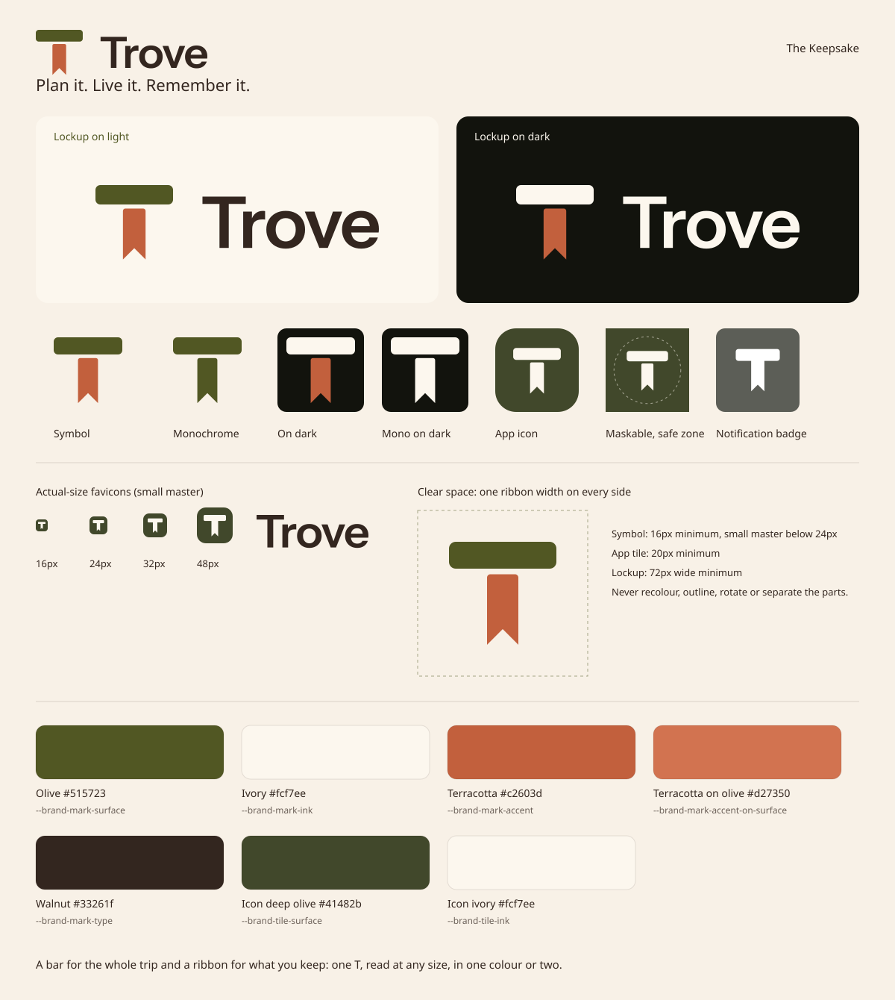

# Trove brand

## The Keepsake

The mark is a T made of two parts. The **bar** is the whole trip, the span of days you plan across. The **ribbon** hangs beneath it like the bookmark in a travel journal and marks what you keep: a saved place, today's stop, the page you return to. *Plan it, live it, remember it*: you mark it, follow it, and keep it.

One idea, one silhouette. The mark reads as a T at 16px, holds in a single flat colour, and uses no pins, planes, globes or compasses.

## Source of truth

Every asset is drawn from `apps/web/lib/brand/identity.ts` and the `--brand-mark-*` tokens in `apps/web/app/globals.css`. After changing either, run `pnpm --filter @trove/web brand:generate` and commit the output; `brand:check` runs before every web build and fails on stale assets. In the app, use `BrandMark` and `BrandLogo` from `components/brand-logo.tsx`; never redraw the mark inline.

## Construction

On a 64-unit artboard, the live area is 48 × 46:

- **Bar:** 48 × 12 at (8, 9), corner radius 3.
- **Ribbon:** 14 wide, starting 2.5 units below the bar, foot at y 55, with a 90° swallowtail notch 7 units deep.
- **Small master** (renders of 24px and below: favicons, the notification badge): the ribbon fuses into a slightly heavier bar, because the gap and its rounded shoulders are sub-pixel at that size.
- **Wordmark:** Instrument Sans SemiBold (SIL OFL 1.1), outlined at weight 600, with the font's kerning tightened by 20/1000 em per pair. It never renders from a font file.
- **Lockup:** the symbol stands 1.45 cap heights tall, centred on the capitals, 1.3 ribbon widths from the wordmark.

## Files

All generated into `apps/web/public/brand` and `apps/web/public/icons`:

| Variant | Symbol | Wordmark | Lockup |
|---|---|---|---|
| Full colour, light ground | `trove-mark.svg` | `trove-wordmark.svg` | `trove-lockup.svg` |
| Full colour, dark ground | `trove-mark-inverse.svg` | `trove-wordmark-inverse.svg` | `trove-lockup-inverse.svg` |
| One ink, light ground | `trove-mark-monochrome.svg` | `trove-wordmark.svg` | `trove-lockup-monochrome.svg` |
| One ink, dark ground | `trove-mark-monochrome-inverse.svg` | `trove-wordmark-inverse.svg` | `trove-lockup-monochrome-inverse.svg` |

App and platform icons:

- **App tile:** `trove-icon.svg`, plus `icons/trove-{180,192,512}.png`. Olive tile, radius 25%, mark at 76%.
- **Maskable:** `trove-icon-maskable.svg` and `icons/trove-maskable-512.png`. Full bleed, mark at 66%, inside the 40% safe-zone radius (tested).
- **Favicon:** `app/icon.svg` and `app/favicon.ico` (16, 32, 48), small master in ivory on olive.
- **Notification badge:** `icons/trove-badge-96.png`, a white silhouette on transparency.
- **Share card:** `trove-og.png`, 1200 × 630, the lockup on olive with no other words.

## Colour

| Token | Value | Use |
|---|---|---|
| `--brand-mark-surface` | `#515723` olive | App tile; the bar on light grounds |
| `--brand-mark-ink` | `#fcf7ee` ivory | The bar on the tile and on dark grounds |
| `--brand-mark-accent` | `#c2603d` terracotta | The ribbon on light (3.9:1) and dark (4.5:1) grounds |
| `--brand-mark-accent-on-surface` | `#d27350` | The ribbon on the olive tile, where the base terracotta measures 1.8:1 |
| `--brand-mark-type` | `#33261f` walnut | The wordmark in exports; in the app it follows the text colour |

The bare symbol switches only its bar between appearances (`--brand-symbol-bar`). The tile never changes.

## Clear space and minimum size

- Clear space is one ribbon width (14/64 of the symbol's size) on every side.
- Symbol: at least 16px; use the small master below 24px.
- App tile: at least 20px.
- Lockup: at least 72px wide.

## Misuse

Don't recolour the parts, swap their colours, or set the full-colour symbol on olive (use the tile or the one-ink inverse). Don't add outlines, shadows, gradients or effects. Don't rotate, stretch, or separate the ribbon from the bar. Don't set "Trove" in live type as a logo; the wordmark is outlined.

## Icons

**Family.** Lucide, and only Lucide: rounded caps and joins on a 24-unit grid. Create a custom icon only where no Lucide glyph carries the meaning, and build it with `createLucideIcon` on the same grid. None is needed today: Lucide's bookmark and ribbon-marked book already echo the mark.

**Stroke.** `--icon-stroke` (1.5px) everywhere, drawn as a non-scaling stroke so it matches Instrument Sans at any size. Contexts of 14px and under (badges, chips, small buttons) set `--icon-stroke-compact` (1.25px). Active navigation sets `--icon-stroke-emphasis` (2px).

**Size.** 12px for metadata, 14px for compact controls, 16px for buttons, menus and rows, 20px for navigation and section headers, 24px inside empty-state tiles.

**States.**

- **Default:** `currentColor`, muted for secondary icons.
- **Hover:** a colour shift, plus a tint on icon buttons.
- **Active navigation:** brand colour, the indicator bar or underline, a semibold label and the emphasis stroke. Never colour alone.
- **Focus:** the visible focus ring.
- **Disabled:** 50% opacity.
- **Motion:** spinners and rotating chevrons respect reduced motion.

**Accessibility.** Every icon-only control needs an accessible name. Decorative icons are `aria-hidden`. Targets are at least 24px, and 44px for primary and touch navigation.

**One glyph per concept.** Import concept icons from `apps/web/lib/icons.ts` (`import * as Icons from '@/lib/icons'`, then `<Icons.Trips />`). Lint rejects the concept glyphs from anywhere else, and a test rejects two concepts sharing a glyph. Generic controls (close, chevrons, edit, delete, overflow, search, copy, share, an inline add) import from `lucide-react` directly.

| Area | Concepts |
|---|---|
| Navigation | Home (House), Trips (Waypoints), Saved (Bookmark), Tools (Wrench), Create (Plus) |
| Experiences | Itinerary (CalendarDays), TripMode (Compass), Preview (Eye), Memories (BookMarked), Highlight (Gem), Now (Clock3) |
| Places | Places (MapPinned), Place (MapPin), CustomPlace (MapPinPen), DailyBase (BedDouble), MapView (Map), Directions (Navigation) |
| Planning | PlanScore (Gauge), Ai (Sparkles), Reservations (Ticket), Expenses (WalletCards), Tasks (ListChecks), TaskTemplates (ClipboardList), Notes (StickyNote), TripInfo (Info), Currency (Coins), MustGo (Flag), Other (Shapes) |
| Status | Error (CircleAlert), Warning (TriangleAlert), Success (CircleCheck), Offline (WifiOff), Sync (RefreshCw) |

`tripSectionIcons` gives every trip destination its glyph, so the trip overview, Trip Mode's tools and the trip menu always agree.
